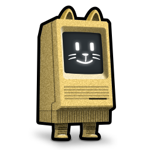

Some icons
==========

I made some icons for my Mac.

  
  
  
  
  
  
  

FWIW, I use these for Brave Browser, Alacritty Terminal, Kitty Terminal, Ghostty Terminal, MacVim, and Neovide.

Installation
------------
Kitty provides a way to [replace the default icon](https://sw.kovidgoyal.net/kitty/faq/#i-do-not-like-the-kitty-icon).
For the others, you can use [fileicon](https://github.com/mklement0/fileicon).

